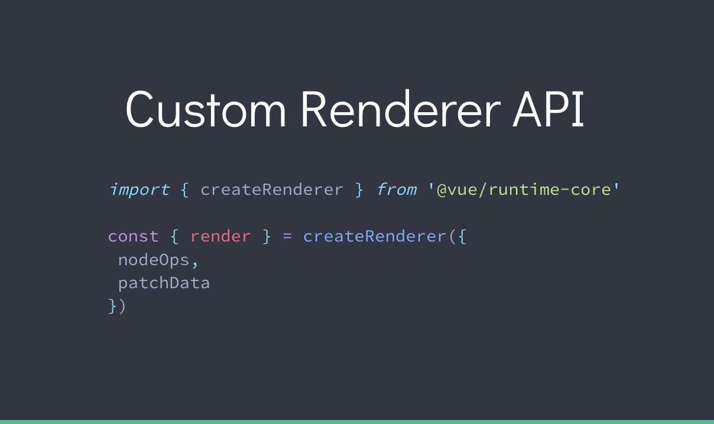

> 来自：开源中国
> https://www.oschina.net/news/101906/vue-3-0-updates

可以看到，Vue 3.0 将会：

1、更快

- Virtual DOM 完全重写，mounting & patching 提速 100% ；

- 更多编译时（compile-time）提醒以减少 runtime 开销；

- 基于 Proxy 观察者机制以满足全语言覆盖及更好的性能；

- 放弃 Object.defineProperty ，使用更快的原生 Proxy ；

- 组件实例初始化速度提高 100％ ；

- 提速一倍/内存使用降低一半。

2、更小

- Tree-shaking 更友好；

- 新的 core runtime: ~10kb gzipped

3、更易维护

- Flow -> TypeScript

- Decoupled Packages（解耦包）

- 编译器重写

4、更易于原生

- 自定义 Renderer API

5、让开发者更轻松

- Exposed reactivity API

- 轻松识别组件重新渲染的原因

- 改进 TypeScript 以支持 w/TSX

- 改进警告追踪

- Experimental Hooks API

- Experimental Time Slicing Support

- 支持 IE11